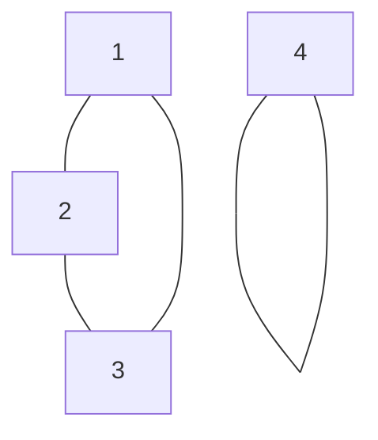

# Permutation [[Group]]
Here we consider a bijective permutation function over the set $A$ (it is 1-1 and onto $A$). 

A permutation group of a set $A$ is a set of permutations of $A$ which forms a group under composition of functions. 

Consider the set $A=\{1,2,3,4 \}$ and the permutation function $\alpha : A \to A$ such that:
$$\alpha(1)=2, \alpha(2)=3, \alpha(3)=1, \alpha(4)=4$$
We can express this in a table format for $\alpha$ in the following:
$$\alpha = \begin{bmatrix}
1 & 2 & 3 & 4\\  2 & 3 & 1 & 4
\end{bmatrix}$$
If we start at $1$ observe that $1\to 2 \to 3 \to 1$ which gives us 1 cycle, and we also have $4 \to 4$:

We also introduce cycle notation, which allows us to write our permutation more succinctly as:
$$(123)(4)$$
Where $123$ expresses the map $1 \to 2 \to 3 \to 1$ and $4$ expresses $4 \to 4$. 

# Properties of Permutations 
### **(THM) Products of Disjoint Cycles**
Every permutation of a finite set can be expressed as a cycle or as a product of disjoint cycles 

##### __Proof.)__ 
Let $\alpha$ be a permutation on $A=\{1,2,3,4, \dots , n \}$. To write $\alpha$ in disjoint form, let us start by choosing some $a_{1} \in A$. Let us then write the following sequence:
$$a_{2}=\alpha(a_{1}),\alpha_{3}=\alpha(a_{2}) = \alpha^2(\alpha_{1})$$
Also, let us denote:
$$\alpha^0(a_{i})=a_{1}$$
Since $A$ is finite, the sequence eventually must repeat, we will eventually be able to find $i,j$ where $0 \leq i < j$: 
$$\alpha^{i}(\alpha_{1}) = \alpha^j(a_{1})$$
Since $\alpha$ is a bijective function, it has inverses, so we can write:
$$\alpha^{-i} \alpha(a_{1})=\alpha^{-i} \alpha^{j(a_{1})}\iff a_{1} = \alpha^{j-1}(a_{1}) $$
Then, let $m=j-1$. After $m$, then the sequence $a_{1},a_{2}, a_{3}, \dots, a_{m}$ clearly would repeat, therefore it is cyclic and describable using cyclic notation:
$$(a_{1},a_{2}, \dots , a_{m})$$
In the case that all elements are contained in the cycle above, then we would be done. Otherwise, we need to pick another element $b_{1}$ not in the above cycle and similarly:
$$b_{2}= \alpha(b_{1}), b_{3}=\alpha^{2}(b_{1}), \dots$$
Again, it must be finite, and thus must eventually repeat such that we obtain another finite cycle that we can describe using cyclic notation
$$(b_{1},b_{2}, \dots, b_{k})$$
#### __Claim__.) 
This new cycle should have no overlapping elements with the previous one. BWOC, assume that:
$$\alpha^{i(a_{1})}=\alpha^{j(b_{1})} \iff \alpha^{i-j}(a_{1})=b_{1}$$
Thus, $b_{1}=a_{t}$ for some $1 \leq t \leq m$, but this contradicts the assumption that $b_{1}$ is not a part of the cycle which is generated by $a_{1}$. Thus, the two cycles have no elements in common $\diamond$. 

If the cycles:
$$(a_{1},a_{2}, \dots, a_{m})(b_{1},b_{2},\dots , b_{k})$$
hit all elements in $A$, we are done, otherwise, we can choose another $c_{1}$ from $A$ and repeat the algorithm, which must necessarily be disjoint from the other cycle, and continue this process until we run out of elements. This is possible since $A$ is finite. $$\tag*{$\blacksquare$}$$
### **(THM) Disjoint Cycles Commute**
If the pair of cycles $\alpha=(a_{1},a_{2},a_{3}, \dots, a_{m})$ and $\beta=(b_{1},b_{2},b_{3}, \dots, b_{n})$ have no common entries, then:
$$\alpha \beta = \beta \alpha$$
### __Proof.)__
Let us say that $\alpha,\beta$ are permutations of the set 
$$S= \{a_{1},a_{2}, \dots, a_{m}, b_{1}, b_{2}, \dots, b_{n}, c_{1}, c_{2}, \dots, c_{k} \}$$
To prove $\alpha \beta = \beta \alpha$, it must be shown that:
$$(\alpha \beta)(x) = (\beta \alpha)(x), \forall x \in S$$
##### Case 1.)

---
# Examples.)

### _Ex 1.)_ $n=6, \beta : \{1,2,3,4,5,6 \}$ where:
$$\beta(1)=5, \beta(2)=3,\beta(3)=1,\beta(4)=6, \beta(5)=2, \beta(6)=4$$
Which we can thus describe as:
$$\beta = \begin{bmatrix}
1 & 2 & 3 & 4 & 5 & 6\\  5 & 3 & 1 & 6 & 2 & 4
\end{bmatrix}$$
Which can equivalently be expressed using cycle notation as:
$$\beta = (1523)(46)$$
A cycle of [[Order]] 2 is known as [[Transposition]]. 

### _Ex 2.)_ [[Symmetric Group]] (Read More There)

### _Ex 3.)_ Dihedral Group (Symmetries of a Square)
All of the symmetries of a square are given by [[Dihedral Group]] $D_{4}$. We can represent the rotations in this group of $\frac{\pi}{2}$ by $A=\{1,2,3,4\}$ and use $\alpha$ to give us the following set of rotations:

```tikz 
\usepackage{tikz}
\begin{document}
\begin{tikzpicture}[domain=0:4] % Set default domain
    % Draw grid and axes
    \draw[very thin,color=gray] (-0.1,-1.1) grid (3.9,3.9);
    \draw[->] (-0.2,0) -- (4.2,0) node[right] {$x$};
    \draw[->] (0,-1.2) -- (0,4.2) node[above] {$f(x)$};


    % Plot f(x) = sin(x) (note the 'r' for radians)
    \draw[color=blue, domain=1:3] plot (\x,1) node[right] {$1$};
    \draw[color=blue, domain=1:3] plot (3,\x) node[left] {$3$};
    \draw[color=blue, domain=1:3] plot (\x,3) node[right] {$2$};
    \draw[color=blue, domain=0:2] plot (1,3-\x) node[right] {$4$};
    
	  


\end{tikzpicture}
\end{document}
```


$$\alpha = \begin{bmatrix}
1 & 2 & 3 & 4\\ 2  & 3 & 4 & 1
\end{bmatrix} \iff (1234) $$
Then the reflections can get us:
$$\begin{bmatrix}
1 & 2 & 3 & 4\\ 2  & 1 & 4 & 3
\end{bmatrix} \iff (12)(34)$$
Therefore, we can express $D_{4}$ as a subgroup of the [[Symmetric Group]] $S_{4}$. 