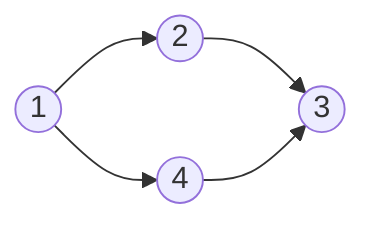

# Directed Acyclic Graph (DAG) Definition
We can define a DAG as a [[Graph]] which contains no directed [[cycle]]. DAGs are [[Directed Graphs]] which have no cycles. For instance consider the following:

It may appear as though we have a cycle, but there is no way to return back to any node along our graph. An example of a DAG is a [[Tree]]. 

---
# Topological Order of Graph
We can call a topological ordering a function $f$, which assigns indices to vertices over the vertices $V$ in our graph $G$, where the edges $(u,v) \in E$ have the property that $f(u)<f(v)$. 

Since we are working with a directed graph, our order matters. Our $u$ comes before $v$ in the ordering of our vertices. The edge $(u,v)$ is a directed edge, and to enforce this order it is the case that the ordering function applied to the first node is less than that of the second. 

Let us apply this idea to the graph below:

Our topological ordering must begin at $1$, since if it began at any other node we would not be able to access all other nodes within our graph. From this, we can impose an order function, which is NOT unique. We process each component level wise, and obtain the following valid orderings:
$$1,2,4,3$$
$$1,4,2,3$$
---
# Finishing Order 
The finishing order is another notion of order. The finishing order of our DAG tree is the order in which the Full [[Depth First Search]] runs into nodes which have already been processed. 

When we run full DFS, we go through each vertex. We check if the vertex has been processed. If the vertex has already been seen, it becomes the next node in our "Finishing Order" sequence. 

It turns out that if we reverse our finishing order sequence it is actually a topological order.  We can prove this result. Let us consider an edge along a directed graph, $G$, given by $(u,v) \in E$. We want to show that given a reversed finishing order that vertex $u$ is ordered before vertex $v$. 

We have two cases. If $u$ comes before $v$ or if it comes after. 

Let us consider the case where $u$ comes before $v$. In our full DFS algorithm, we would get to node $v$, which we then run DFS on. In order for $u$ to finish, we need to first finish $v$. So, $v$ would come before $u$ in our call, and when we reverse it we would get $u$ coming before $v$, which satisfies our case. 

Our second case sees $v$ being visited before $u$. Note that by the definition of our edge that there is a directed connection from $u$ to $v$. Since we are considering DAG trees, it follows that there is no other path that allows us to get from $v$ to $u$, so we cannot get this order. 

This gives a proof that reversing the finishing order is a topological order. 

---
# Cycle Detection
Let us consider the directed graph $G$. We do not know if it is cyclic or not. We can test this by running full DFS and then extracting its reversed finishing order. It turns out that if one of our nodes is out of order, this implies that $G$ is not a DAG. 

The ONLY thing that could have gone wrong is that we do not have a DAG. This is the only condition. We can also identify the cycle in our graph. If we have a cycle, it will appear as:
$$(v_{0},v_{1},\cdots,v_{k},v_{0})$$
Where $v_{k}$ is an ancestor of $v_{0}$, and since we have already seen $v_{0}$, we would deduce that there is a cycle in our graph. 