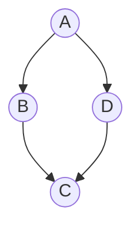
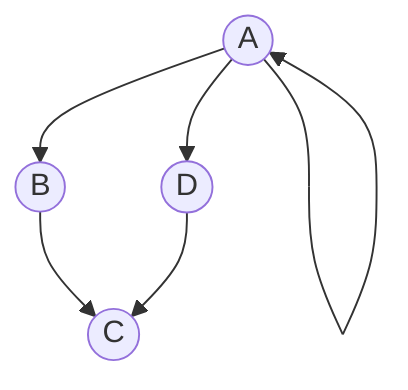
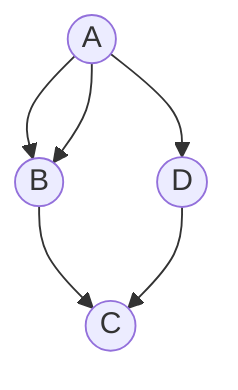
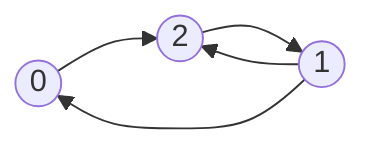
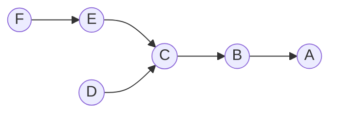

# Graphs
A graph is a mathematical structure that can be defined by three components. A graph consists of vertices, a set of edges that connect our vertices, and in total a graph set that contains both:
$$G=(V,E)$$
$$V=\text{Vertices}$$
$$E=\text{Edges} \subseteq V \times V$$
There are two kinds of graphs we care about. [[Directed Graphs]] and [[Undirected Graphs]]. Directed graphs have an ordering in their edges that matters. Undirected graphs have an ordering that doesn't matter. For example, let us consider $v,w \in V$. 

If $G$ is undirected then:
$$e = \{ v,w \} $$
Which means that our our order between the two vertices is irrelevant. 

If $G$ is directed then:
$$e=(v,w)$$
Which means that our order between the two orders is very relevant, meaning that $v$ connects to $w$, but $w$ does not connect to $v$. 

This a directed graph since our order matters in how nodes are connected.![[Pasted image 20250713224631.png]]
Whereas this is an undirected graph since the orientation of our arrows is irrelevant.

---
# Simple Graphs

We want to limit ourselves to the type of graphs that we work with. We are interested in [[Simple Graphs]]. A simple graph has no loops and also has distinct edges, meaning that no edges go from a node back into itself, and that there is at most one edge between two vertices.

The following tree would be an example of a non-simple graph that violates the loop property:

The following tree would be an example of a non-simple graph that violates the multiple edge property:

Simple graphs also have the nice property that:
$$|E|=O(|V|^2)$$Which comes from:
$$\text{Directed Case: } |E| \leq 2  {|v| \choose 2} = O(|V|^2)$$
$$\text{Undirected Case: } |E| \leq 2  {|v| \choose 2} = O(|V|^2)$$
Which is important because sometimes we want to consider an algorithm's success when we want it to be proportional to edges or vertices, since some graphs can be very sparse. 

# Neighbor Set
We have a lot of different kinds of neighbors for graphs. 

For directed graphs we have outgoing and incoming neighbors, which respectively are the nodes that our node touches, and the nodes that touch our node from the outside. 

Let us consider the following Graph:

The out going neighbor set, denoted by Adj$^*(n)$ for node $n$. Let us find $Adj^*(0)$:
$$Adj^*(0)=\{ 2 \}$$
Our incoming neighbor set is denoted by $Adj^-(0)$ and is:
$$Adj^-(0)=\{ 1 \}$$
For an undirected graph we drop the plus and minus and our $Adj$ represents all of the neighbors to a single node. 

We can also consider the degree of our graphs as either outgoing degree or incoming degree, which is equal to the number of pointers to other nodes from a vertex. If we consider the outgoing degree, then we can express our degree as:
$$\sum_{v \in V} \text{deg}^*(v)= \begin{cases} \text{undirected} & 2|E| \\ \text{directed} & |E|\end{cases} $$
The undirected case we can think of as both edges being simultaneously forwards and backwards, and directed as being a move only in 1 direction. 

---
# Representing Graphs
There are many different ways we can represent graphs. One way that we could represent our graphs is by a set of items, which is a sort of standard mathematical definition for it:

For the following graph we can represent it in this manner:

The following representation would be:
$$G=\{(1,0),(0,2),(1,2),(2,1) \}$$
An edgelist is generally not a good way to go about this since finding an edge would take $O(E)$ or $O(|V|^2)$ time to find a connection between two vertices. We have another more interesting way to store a graph known as an [[Adjacency List]].

Our set maps a vertex, $u$, to the set of all vertices connected to it in $Adj(u)$. We typically store this as a direct access array or a type of hashmap that maps to a direct access array or set.

We also have adjacency matrices, where we create an $n \times n$ matrix to represent our graph, and mark $1$ at $i,j$ and $j,i$ if there is a vertex for an undirected graph. This again has a quadratic space complexity. 

---
# Shortest Path Example
If we can build an algorithm to get the shortest path from one node to another, we can use this to solve the problem of reachability. If no such path exists, then we would return a length of $\infty$. We can use this to solve for a path existing. We can also use this to determine the path from one node to all other nodes in our graph.

Let us consider the following undirected Graph:
![[Pasted image 20250714032952.png]]
We can note that, starting at $A$, our path length from $A$ to the next node is:
$$[A:0,B:1,C:2,E:3,D:3,F:4]$$
 Memory storage for storing all paths may be quite cumbersome, so instead, we elect to use a [[Tree]] structure known as the [[Shortest Path Tree]].

# Shortest Path Tree
The shortest path tree allows us to describe the smallest paths between any two nodes along our graph using a [[Tree]] structure, meaning our graph will include no cycles. In our graph, we can think of one vertex to its next nearest vertex, and then think of the next node that connects to it. 

Using this logic, we can construct the following tree:

Storing items in this manner is better than other methods where we take $|V|^2$ storage, here we are merely making use of $|V|$ storage since for each node there is one edge or so. 

If we want to trace the shortest path from some node, $N$, to $A$, all we need to do is keep walking from $N$ until we reach node $A$. In order to do this we need a function, $P(v)$ which gives the next vertex in our sequence of a shortest path from a node to $A$. All we would do to find our shortest path is keep feeding this function into itself until we can reach $A$. 

Any time we change our number of edges or paths, we end up needing to recompute everything since there is a chance we messed up some characteristics of our tree. We can prove that our result holds here. 

If we examine the case where $k=0$ we get no parents nodes, this holds since this is treated as the "'root node" sort of. If we assume that this idea holds for the first $k$ nodes in our inductive step, it would be true that for any $v$ satisfies that it has a distance given by:
$$\delta(s,v)=k+1$$
If $u \in V$ is the previous shortest path for which $\delta(s,u)=k$ since $u$ is the predecessor to $v$ so it comes before it by 1. From here we have 2 base cases, where we have a value for the parent already at our node or none, in which cases we correctly set our node, or we continue forward. 

---
# Connectivity 
The main idea behind connectivity is that there is a path from one node to any node within our graph. We can define notions of connectivity for both directed and undirected graphs. 

A graph is said to be [[connected]] if for any two vertices along our graph, there exists a path between the two. This is our notion of connectivity along undirected graphs.

We define a [[connected component]] as a set of vertices that are linked by paths. 