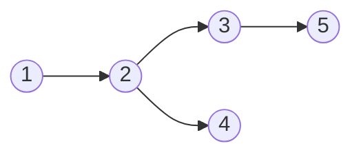

# Single Source Reachability Problem Definition
Single source reachability asks us, on a Directed [[Graph]], what nodes can we reach given a source node? We already have posed an answer by solving the related [[Breadth First Search]] problem, which results in a length of $\infty$.  

We may just want to know if such a path exists, we may want to know the length of said path, or an example of it itself as additional caveats on this. In the Shortest Path Problem we opted to use the [[Shortest Path Tree]] algorithm. Here, we can implement something similar called the [[Parent Tree]] algorithm. 

If we have a reachability problem in our graph, we can give every node in our tree a parent node relation, meaning that it gives us a pointer back to the node that pointed to it. We can go down all possible baths until we get back to the source node. If we flip the order of the nodes we traversed, we would get a valid path sequence from the end to our beginning. 

We are basically crawling outwards through our graph, we begin at one node, we move to other nodes which are within its outward adjacency list, and continue this process until we run into nodes which have parents, or we have no more nodes that we can process. Here is some pseudo-code for this algorithm:

```python
def visit(u : Node):
	for v in u.outgoing_adj():
		if p(v) == None:
			p(v)=u
			visit(u)
```

Let us consider the following graph:

We can consider the DFS algorithm on this tree. Let $1$ be the source node. 

We would visit $1$, first via our DFS, which has no new neighbors, which we would call through again to get 3 and 4 on our stack. We would process 3 first, which gets 2 as a parent, and then process 5 which gets 3 as a parent, then we have no more nodes to process, so we move back down to 4. When we are at 4, we set 2 to be our parent, and then we terminate.  

We can prove that for each node that is a distance $k+1$ from our source node $s$, that our DFS algorithm properly links its parent, and it also traverses each node. Let us consider each node that has a distance $k$ from a source node $s$. When $k=0$, we can see that the source node has no node, and also it traverses every node in this range. 

If by induction we assume that for all nodes from distance $k$ from $s$, we assume that each node has a correctly assigned parent, and all nodes at this level are traversed. 

Let us now consider the nodes located at $k+1$. We know that the previous node that is the parent of this node, $u$, has a distance given by $\delta(s,u)+1=k+1$. We know it has a parent, and we can set its parent to $u$ if the node doesn't have a parent, however if it does have a parent it's already been assigned and we ignore it.  

---
# Algorithmic Analysis of DFS
All DFS can do is reach values that are accessible from the source. We never reach a vertex which is not reachable, the same as BFS. Through DFS, we only iterate over each edge, and traverse each until all edges have been seen. In conclusion our runtime is:
$$O(|E|)$$

--- 
# Full-DFS Algorithm
We can define our full DFS algorithm as a DFS that operates on every vertex along our graph. With our other DFS algorithm, we may only be constrained to a specific connected portion of our graph. We want to get around this condition and create an algorithm to check all vertices along [[Undirected Graphs]] that are potentially [[unconnected]].

We can give our algorithm by the following:
``` python
for vertex in G:
	if not visited(vertex):
		DFS(vertex)
```
We run our standard DFS algorithm on each vertex that has not been visited essentially. 
As a note, it is important that our visited function is quick to implement here, otherwise we run into increasing our computational size significantly. 

What is our runtime of this algorithm? Well, we run through each vertex, and we run through each edge once, but not more than it since we have a constant checking function to verify if the vertex has been visited or not. This gives a runtime which is proportional to the sum of the number of edges and vertices:
$$O(|V|+|E|)$$
