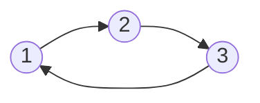
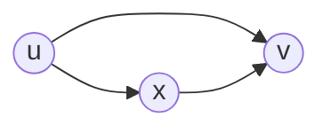

# DAG Relaxation Definition
DAG Relaxation is an algorithm which allows us to find the [[Weighted Shortest Paths]] between two nodes on a [[Directed Acyclic Graph]]. With normal graphs we may have [[negative weight cycle]]s, infinite values paths, and [[cycle]]s in general. With DAGs we do not have to worry about that. 

We pick up with the [[Weighted Shortest Paths]] problem which saw us modify the [[Breadth First Search]] algorithm where we had an existing list of distances, $\delta(s,v)$ for source node $s$ and node $v$ in $G$. We now want a concrete way to actually compute these distances, which will be denoted by $\delta$. To start, we will approximate distance between nodes by $d$.  

We begin the DAG Relaxation algorithm with the assumption that the distance between $s,v$ is less than $\infty$. At each step of our algorithm, we will lower our distance approximation, $d(s,v)$ until we eventually reach a lower bound where we are constrained into having our approximation equal our actual distance, which would be:
$$d(s,v)=\delta(s,v)$$
When we violate the [[Triangle Inequality]], we hit our lower bound. Consider the following graph. The given edges between the vertices do not represent an edge but a [[path]] more generally.

The triangle inequality would state that for any arbitrary vertices in $G$, it follows that:
$$\delta(1,2) \leq  \delta(2,3)+\delta(3,1)$$It follows that if our estimate for distances violate the [[Triangle Inequality]], it follows that we have found a lower bound for the length of our edges. 

Let us consider the edge $(u,v) \in E$, and for a path $\pi_{ux}$ between $u,x$ and $\pi_{xv}$ for $x$ and $v$. We have the following graph:

The distance  between $u,x$ and $x,v$ is approximated via $d(u,x)$ and $d(x,v)$. We know the precise [[weights]] of $(u,v)$ which is $w(u,v)$. 

Our inequality is violated if for the source node $s$, the following is untrue:
$$d(s,v)>d(s,u)+w(u,v)$$
If this is the case, our temporary solution is to set $d(s,v)$ to $d(s,u)+w(u,v)$. This is what we mean by "relaxing" an edge. Relaxation is "safe", meaning that we maintain the property that we have some weight to $v$ from $s$ or we have an infinitely weighted path. 

We can prove that this property is true. Let us try and relax $(u,v) \in E$. We set $d(s,v)=d(s,u)+w(u,v)$. We let $d(s,v)$ is the weight of some path, which implies that $d(s,u)$ is also the weight of another path. We would be maintaining the weight of all paths through this process and ensuring that all paths are relaxed.

We claim that at the end of the algorithm, $d(s,v)=\delta(s,v)$. This can be proved inductively. 

---
# Dag Algorithm 
When we begin our algorithm, we initialize all $d(s,v)=\infty$ and then set $d(s,s)=0$. We process each vertex $u$ in a [[Topological Sort]] order. We have some source vertex, and we begin to process all of our vertices down this topological sort order. 

For each vertex, we process its outgoing adjacency list, and we look at our triangle inequality. If our inequality is violated, then we relax our edge.

Here is the full algorithm in pseudocode:
```algorithm
set d(s,v) = infty
set d(s,s) = 0

for u in topological_sort_order
	for each v in adj(u)
		if d(s,v) > d(s,u) + w(u,v):  
			d(s,v) = d(s,u) + w(u,v)
```

Our algorithm overall should take linear time, since we process each edge and vertex, and get a resulting runtime of:
$$O(|V|+|E|)$$ 