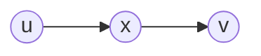
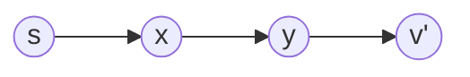

# Dijkstra's Method Introduction
Previously, we have seen several algorithms for finding [[single source shortest paths]], including [[Bellman-Ford]] which allows us to find a SSSP in $O(|V|\cdot|E|)$ time on any type of graph thereby being the most versatile pathfinding algorithm which can deal with [[negative weight cycle]]s, [[Breadth First Search]] which allows us to find a SSSP in $O(|V|+|E|)$ time on a graph which has constant positive value edge weights, and the [[DAG Relaxation]] algorithm which runs in $O(|V|+|E|)$ time and allows us to find a SSSP on a [[Directed Acyclic Graph]] (since we have no cycles, we don't need to worry about negative weight cycles and we are fine). 

Dijkstra's Algorithm is a middle ground between the above algorithms. It has a faster runtime in its worst-case at $O(\text{log}(|V|)|V|+|E|)$ and is therefore quasilinear. It can only run on [[Graph]]s which have non-negative [[weights]] between its vertices, even if they have cycles. 

We can think of this algorithm as a blossom or circular wave that comes out from our original source point, and traverses until it can find the edge. Given the constraints of entirely positive edge-weights along our graph, we run into the following observations that we will use in the derivation of our algorithm:

1. If weights $\geq 0 \implies$ distance along SPs only increases. 
	* If we consider the bottom graph, let us not think of $u,v$ as a direct path but as a sequence of vertices, a shortest path, we denote it by $\delta(u,x)$. The shortest path from $u\to v$ is given by the previous path plus the edge weight from $w(x,v)$ since $x$ and $v$ directly connect. Since edge weights are non-negative it follows that:
	$$\delta(u,x) \leq \delta(u,x)+w(x,v)=\delta(u,v)$$

2. We can solve SSSP faster if we have an ordering of vertices in increasing distance beforehand from our source node $s$. We want an ordering of vertices such that a higher position on the ordering correlates to a further distance from our source vertex. We can also see that we cannot go backwards in our ordering with positive weights onto vertices we have already traversed. 

We would like to transform our current graph into a simplified [[Directed Acyclic Graph]] that we can run [[DAG Relaxation]] on which preserves connections. Cutting out positive weight cycles additional [[edge]]s that create cycles only add distance and so are extraneous.  

Ideally, we would like to be able to choose the smallest distance at each iteration from out source that leads to our end. 

---
# Dijkstra's Algorithm Formally
The main idea of our algorithm is to relax edges with increasing distance from source node $s$. To do this, we need to be able to find the next vertex efficiently. The way we will do this will be with the use of a Data Structure known as a "Changeable [[ Priority Queue]]"

The Changeable Priority Queue will support the following operations on a set of $n$ iterable items, $X$:
- Q.build($X$)
- Q.delete_min() 
- Q.decrease_key(id,k)

The build and delete min function are supported on normal [[Priority Queue]] functions. Decreasing our key is the unique function here. We take in an $id$ of a an item in our queue, and then we decrement the key to a smaller value, $k$. We always ensure that $k<id$. 

If we wanted to implement such a structure, we could make use of a [[Hashing]] Map (Hashmap). We use a regular priority queue, $Q'$ and a hashmap $H$. We will use our hashmap to keep track of our distance estimates, for $v \in V$, $d(s,v)$.  We begin by setting all of our distances to positive infinity, and $d(s,s)=0$:

```
for v in vertices:
	d(s,v)=infty
d(s,s)=0
```

We then go on to create our Changeable Priority Queue (CPQ), we initialize each element to be an item tuple, denoted by item$(x.id,x.key)$ where our key is $d(s,v)$ the estimated distance from $s$ and $v$ is our vertex:

```
#add to our CPQ 
for v in vertices:
	CPQ.add((v,d(s,v)))

#delete min distances at each step, and relax edges each iteration
while(CPQ not empty, delete (u,d(s,u)) that has min distance)
	for v in Adj+(U):
		#check triangle inequality, relax if violated 
		if d(s,v) > d(s,u) + w(u,v):
			relax(u,v) : d(s,v)=d(s,u) + w(u,v)

			#since we just decreased the edge length, we change size of the key
			decrease key of v in Q to new d(s,v)

```

When we remove a vertex from our CPQ, let us denote the removed vertex by $u$, we set its distance to be the final distance we recorded from $s$ to $u$, thus:
$$\text{when we delete u it follows that: } \delta(s,u)=d(s,u)$$

---
# Correctness of Dijkstra's Algorithm:
We can argue correctness by claiming that if $d(s,v) = \delta(s,v), \forall v \in V$ then  we have correctly found the distances. We can argue this by showing that if relaxation sets $d(s,v)=\delta(s,v)$ is true at the end, then we never change our value later on. 

Relaxation can only ever decrease our distance, so it will never go upward. We have also previously seen that relaxation is "safe", meaning that we either have an infinite length if no such path between vertices exists, or we get the length of some path from $s \to v$. 

If we show that $d(s,v)=\delta(s,v)$ when $v$ is removed from our CPQ, then we have shown that we have found the correct distances. We can prove this result by induction on the first $k$ vertices which are removed from $Q$. We have the base case of the source vertex, $s$ which clearly must work since $\delta(s,s)=d(s,s)=0$ as it is the first vertex removed from our ordering. 

Let us now assume that is true for the first $k<k'$ vertices, and let us set $v'$ to be the $k'th$ vertex popped from our queue. 

Let us consider the path from $s \to v'$. We want to be able to induct along this path.  We know a shortest path exists between the two vertices since our graph is connected. Some vertices have been removed from our shortest path, and some other vertices might have not been removed. We know that $s$ was removed via the inductive step. 

Let us consider the vertex $y$ which is not in our queue that is along our shortest path from $s$ to $v'$. It may be the case that $v'=s$. Let us say that the predecessor of $y$ is $x$:


We know that $x$ and that all of the nodes beforehand in the path are not in the queue, meaning by induction their distances are set correctly. 

This gives us the following identity:
$$d(s,y)\leq \delta(s,x)+w(x,y)$$
Since we assumed that this was the smallest path to $y$, we can conclude that:
$$d(s,y)\leq \delta(s,x)+w(x,y) = \delta(s,y)$$
If $s=y$, then it turns out that we are done, but this does not cover all cases. We can see that the path from $s\to v'$ must be constrained by the true distance to $v'$:
$$d(s,y)\leq \delta(s,x)+w(x,y) = \delta(s,y) \leq \delta(s,v')$$
Since we know that relaxation is safe, it follows that our estimate is going to be greater than or equal to our actual distance:
$$d(s,y)\leq \delta(s,x)+w(x,y) = \delta(s,y) \leq \delta(s,v') \leq d(s,v')$$
We are removing the smallest distance in our queue, which is $v'$. It follows that our estimate for our distance from $s\to y$ must be  smaller than our distance to $y$, which is in our queue. It follows that:
$$d(s,y)\leq \delta(s,x)+w(x,y) = \delta(s,y) \leq \delta(s,v') \leq d(s,v') \leq d(s,y)$$
However, all this does is just show that all of the following things inside are equivalent, so this means that $d(s,v')=\delta(s,v')$ so our inductive step is true, meaning we have a minimum distance here. 

---
# Analysis of the Runtime of Dijkstra's Algorithm
Since we do everything in terms of our queue operations, we will need to find its queue build time and delete time. Let us denote these by $B$,$D$ and $M$. 

We build once, and we delete the minimum $|V|$ many times. We need to relax every outgoing edge for every single edge. Our runtime is thus:
$$O(B+|V|M+|E|D)$$
Depending on our implementation of our algorithm, we end up with various runtimes. If we use a binary heap we get a runtime of:
$$\text{array} = O(|V|^2)$$
$$\text{binary heap } = O(|E|\text{log(|V|)}$$
$$\text{fibonacci heap } = O(|E|+|V|\text{log(|V|)}$$
The Fibonacci heap algorithm performs very well for both [[sparse]] and [[dense]] graphs. Theoretically, we opt for the fibonacci heap's runtime, which is quite nice. In practice, we either use an array implementation or the binary heap implementation depending on the sparsity or density of our graph. 