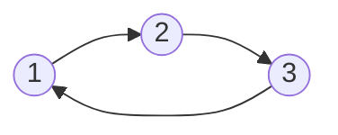
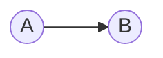

# Weighted Shortest Paths Introduction
When we have considered [[shortest path]] problems, we have considered [[Graph]]s which have unweighted edges. Finding the shortest path has been equivalent to finding the path that contains the least number of edges thus far. 

Let us impose a [[weight function]] onto our Graph, which, given an edge $(u,v) \in E$, the weight function $W$ maps our edge to an integer $W : E \rightarrow \mathbb{Z}$. 

When it comes to representing edges with weights in our graph, we can choose to store the weight in our adjacency list in a tuple, or we can use a separate set mapping which maps each edge to a corresponding weight associated with the edge. 

---
# Weighted Paths
We introduce the idea of a weighted path as being the sum of the weights of every edge along the path we have traversed to get from a node, $A$ in our graph to $B$. Our path is denoted by $\pi$, and we can denote the weight of this path by $w(\pi)$ which is equivalent to:
$$w(\pi)= \sum_{e \in \pi} w(e)$$
Which just sums the edge value of each edge in our path $\pi$. The [[shortest path]] is therefore the path which results in the minimum weight path. If we can repeat edges depends upon the context of the problem. It depends upon the kinds of path we are restricted to examining, but generally we exclude looking at many paths. 

We want to define the distance between any two nodes $S,T$ along our graph as $\delta(s,t)= \text{min}\{ w(\pi)  \} \forall \pi \text{ from } S \to T$. The problem with this definition is that if no such path from $S \to T$ exists, then we get a path of $\infty$. We also need to consider what happens when we have negative edges that take us from one node to another:





For instance, the path from $1$ to $3$ if all edges have negative values, then we would keep loop around infinitely and decreasing our amount and get a path, $\pi$, where $w(\pi)=-\infty$.

More formally, if $\exists$ a path from $s$ to $t$ that goes through a vertex on a [[negative weight cycle]], then $w(\pi)=-\infty$. 

---
# Extension of BFS 
We can think of a subset of graphs as having equivalent solutions for shortest paths from $A$ to $B$ along $G$ to graphs with weighted edges. In [[Breadth First Search]] we thought of distance by measuring the number of edges between two vertices. This is equivalent to thinking of each edge having a weight of 1, but this notion can be further generalized to each edge having a positive constant value along all edges. 

Another way we could solve our weighted edges problem is when we have all weights between our graphs with positive edges. We can run BFS by imposing a sequence of $n$ nodes and edges which is equivalent to the weight $n$ of the edge between our node $S$ and $T$

Take the following path between $A$ and $B$ which has a weight of 3:

We cam express this as the following using weight 1 edges in between:

We can count three edges in between $A$ and $B$, which equates to weight 3 path.

If it happens that if the sum is asymptotically less than $|V|+|E|$, it follows that our algorithm runs in linear time, since we are doing no more than $|V|+|E|$ operations

It turns out that if we have a [[Directed Acyclic Graph]], a DAG, then we can solve our problem in linear time using "[[DAG Relaxation]]". We also have [[Bellman-Ford]] which is a more general algorithm for finding shortest paths on weighted graphs. 

---
# Shortest-Path Trees 
Shortest path trees allow us to store the shortest path between nodes $s,v$ in our graph $G$. We impose that we will only consider distances between the source node $s$, and any node $v$ that have a finite distance, that is we only take account of $\delta(s,v) \in \mathbb{Z}$. 

If we are given shortest path distances that are finite and that do not go through negative weight cycles, then we can reconstruct parent pointers along paths in linear time. This would be tantamount to solve our weighted shortest path problem. We only assign parent pointers, using the function $P(v)$, given that $v$ has a finite distance $\delta(s,v)$.

Our algorithm is as follows:
```
init P empty
P(s)=None
for vertex u in V, given that d(s,u) is finite:
	for each v in outgoing_adj of u:
		if v not in P and d(s,v) = d(s,u) + w(u,v):
			then there is a shortest path from s to v
			p(v)=u
```
Since we are given the total distances to each node, our way of checking if the shortest path from $s$ to $v$ can be given by tracing back the parents of $v$ until we get to $s$. The way we can determine this is a valid parent in our shortest path tree is by verifying that the distance to the previous node plus the current edge value is equivalent to the distance from $s$ to $v$, which would imply that $u$ is the parent of $v$.

Essentially, we check that there is a valid path that has no negative cycles from $s$ to $u$, and if this condition is satisfied, we look at each edge node that is pointed to from $v$. We may have cycles in our graph, so we want to be sparing with how we assign parents. And we want our resulting graph generated to be a tree, so we need a condition to verify that our parent will result in the shortest path when we traverse the node to the source. Since each $\delta(s,v)$ is known, and we want to select parents that result in the shortest path, all we need to do is check that if $\delta(s,u)+w(u,v)=\delta(s,v)$ and this would give us our shortest path. 

This gives a linear time algorithm, $O(|V|+|E|)$ like the original [[Breadth First Search]] algorithm. 

Now we need ways to compute our $\delta(s,v)$ values, and then we can compute our parents after. 
