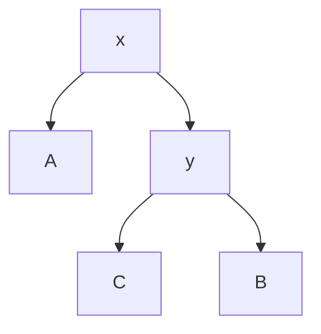
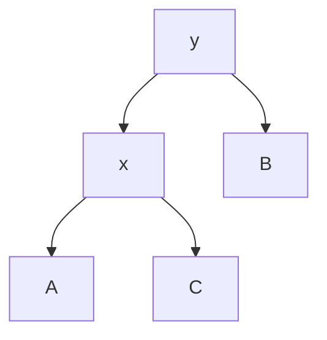
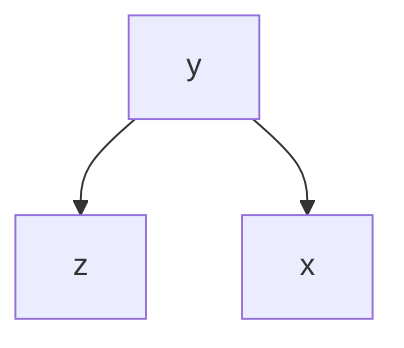
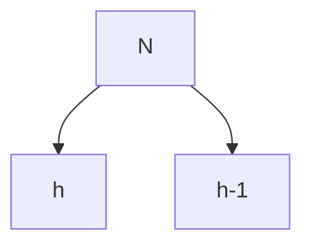
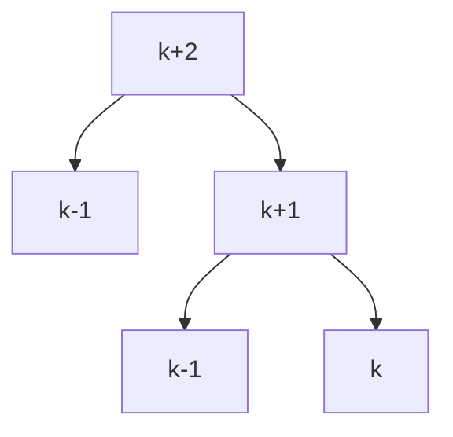
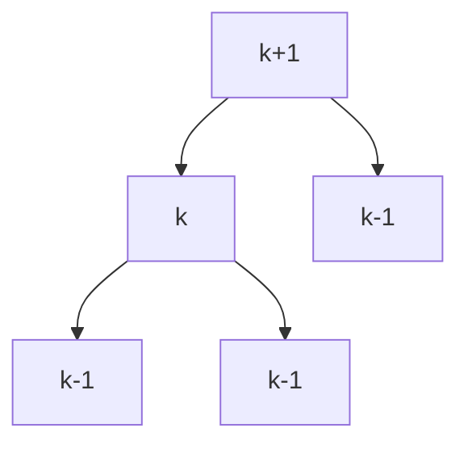

# AVL Trees 
As addressed in [[Binary Search Tree]]s, we can represent a [[Sequence Data Structure]]. If we implement a sequence as a BST, we may want to know what the $i$th item in our [[in-order traversal]] order. 

We have established that all of our operations in previous binary tree lectures occur in $O(h)$ time. We want to show that for a tree with height constraints that we can actually force them to occur in $\text{log}(n)$ time. The main goal of an AVL tree is to give us a [[Balanced Binary Tree]], which is a type of binary tree that has a [[height]] of $\text{log}(n)$.

We need to be able to understand [[Rotations of Binary Trees]]. We want our traversal order to remain invariant, it needs to be invariant and sacrosanct. There are numerously many orders in which we can represent the same data. We need to be able to manipulate it well. 

Consider the following BST where $x$ and $y$ are individual nodes and $A,B,C$ are subtrees:

We want to preserve the fundamental property of our traversal order that our nodes in our sequence will follows:
$$A < x < C < y < B$$
A rotation will preserve this operation. The right rotation of this tree is as follows, where we make the other node, $y$ the new parent node where $x$ used to be and maintain the [[in-order traversal]] order:

Note that our traversal maintains the same order as before. We still have the same ordering if we are to use an in-order-traversal. If we were to go back from this tree to have $x$ as the main root, we would be reversing this operation, and thus the same operation just returns the tree to its original state. This would give us the [[right rotation]] and our previous operation would be the [[left operation]]. 

Using rotations we can maintain that our tree remains at a logarithmic height, such that we can maintain a [[Balanced Binary Tree]]. The condition that we want to main is that the [[height]], for any node, $N$, in our tree maintains the property that:
$$\text{height}(N.left)-\text{height}(N.right) \in \{ 0,1,-1 \}$$
Meaning that we want our heights of our trees to differ by 1. We refer to this quantity as the [[skew]] of our node.  

AVL trees are a type of balanced treed that maintain height balance in our trees. We should make the observation that if we know the height of the subtrees of a node $k$, we can determine the height of the node $k$ itself:

Say we know the height of $x$ and the height of $z$. By the definition of height it follows that our height is $y$ is the maximum of the height of $z$ and $x$ plus 1. That is to say:
$$=\text{max}(z.\text{height},x.\text{height})+1$$
We increment one since we need to count the additional node at $y$. If we know our tree is balanced we know that the two nodes will be at most different by one. 

Let us assume that for the tree with the root node, $N$, that we have a height balanced tree, meaning that at each height we have a skew of absolute value of 1. If the skew is 0, then by definition of such a tree then it would be balanced since its the smallest possible tree, and also if we show that the tree with a skew of 1 is balanced that a smaller tree would necessarily be balanced. 

We are able to establish a recurrence relation using this property and then verify that $h$ is logarithmic. Let us consider the following tree:

It follows that our total number of nodes is equal to:
$$N_{h}=N_{h-1}+N_{h-2}+1$$
This relation is similar looking to that of the [[Fibonacci sequence]], but we can make a smaller recurrence relation that happens to resolve a logarithmic result, consider:
$$2N_{h-2} < N_{h-1}+N_{h-2}+1$$
Somehow our resulting expression would be:
$$2^{\left\lfloor \dfrac{h}{2} \right\rfloor
}$$
Which also somehow indicates that $h \leq 2 \text{log}(n)$ not sure about this some kind of [[recurrence relation]]?

AVL trees make use of the height of every node already being stored, we know that this is a subtree property, which we already have a formula for above:
$$\text{}=\text{max}(z.\text{height},x.\text{height})+1$$
We can compute the skew of all of our nodes when we add or delete a node, we can check to see which is out of bounds after an insertion operation since we update subtree properties in $O(\text{log}(n))$

During our [[skew]] calculation, if our resulting skew $\in \{0,-1,1\}$ we don't need to worry. However if our skew is not within this set we need to perform rotation operations to force our tree to properly behave:

If our bottom nodes on the right side have height $k-1$ and $k$, we go up a node increment by 1, and we would see that the height from one node is $k+2$ which violates [[Balanced Binary Tree]] properties of skew. It turns out if we rotate the node with $k+1$ here, we would mostly be fine for most cases:

