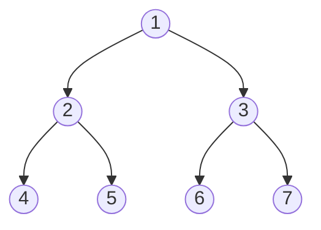
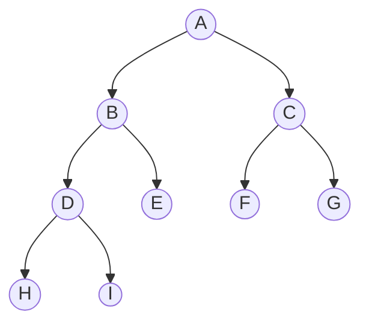
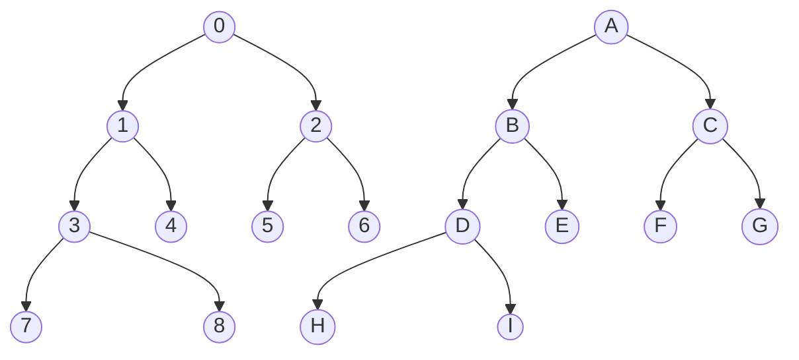

# Binary Heaps
The binary heap is a [[Binary Tree]] like data structure that allows us to solve the problem of [[Sorting]] in a different way and also the idea of a [[Priority Queue]]. 

Binary heaps support the following operations:

| Operation    | Description                            |
| ------------ | -------------------------------------- |
| build($x$)   | initializes items in $x$ into our heap |
| insert($x$)  | adds item $x$ into our heap            |
| delete_max() | deletes largest element                |
| find_max()   | returns largest key                    |
We want to store a bunch of items with keys, and we want to identify the largest item in our set, and then remove it. We have different processes on a compute on a single core, or packets through a router, or something involving time. These give us motivation for priority queues and therefore heaps. 

If we recall, Set [[AVL Tree]]s are able to handle all of these operations, and we can use this to implement our desired operations. But, the heap structure and its operations will allow us to build faster by a log factor, and also give us an in place sorting algorithm. 

Heaps are built out of dynamic arrays and trees in part. Let us quickly summarize the different runtime operations for our data structures at some of the tasks we are looking to solve: 

|                          | Operations       |                 |                 |
| ------------------------ | ---------------- | --------------- | --------------- |
| Data Structure           | build($x$)       | insert($x$)     | delete_max()    |
| [[Dynamic Array]]        | $n$              | $1_{(a)}$       | $n$             |
| [[Sorted Dynamic Array]] | $n\text{log}(n)$ | $n$             | $1_{(a)}$       |
| [[AVL Tree]]             | $n\text{log}(n)$ | $\text{log}(n)$ | $\text{log}(n)$ |
In dynamic arrays assertion is very quick, it is $O(1)$ [[Amortized Analysis]]. The delete operation is $O(n)$ since we need to traverse through the array to find the largest element.

Sorted arrays are the opposite of arrays, our max and min are very quick, and can be found at the ends of the array and accessed in $O(1)$, deleting max is very cheap too at $O(1)_{a}$. However, inserting and building are expensive. 

We can think of our AVL trees as a best of both worlds, but Heaps will give us a new way to handle this. 

---
# Priority Queue Sort 
Serves as a motivation for heaps. Any data structure that supports a find and delete max operation allows us to create a priority queue function. All we need to do is find the largest item, delete it, and insert a new item, and continue this process until we have finished:
- build($A$)
- insert($x$) for $x \in A$
- repeatedly delete maximum

Our total runtime would be given by:
$$T(n)=T_{\text{build}}(n)+n\cdot T_{\text{delete.max}} \leq n(T_{\text{insert}}+T_{\text{delete.max}})$$
When we plug in each algorithm we have discussed into our list, it turns out that we get a sorting algorithm. 
* If we plug in AVL trees, we would get an $n\text{log}(n)$ sorting algorithm, also note we cannot use the build function since it uses sorting which would mean that we are using sorting to solve sorting which isn't allowed. This gives us AVL sort, which would be optimal
* If we plug in normal dynamic arrays we get the [[Selection Sort]] algorithm by repeatedly finding the maximum result and then removing it 
* If we plug in the sorted array, each iteration we plug in a new element and then sort it correctly into our tree, which gives us [[Insertion Sort]]

In total we can observe our time complexities for our sorting algorithms:

|                          | Operations       |                 |                 |     | Priority Queue Sort |          |
| ------------------------ | ---------------- | --------------- | --------------- | --- | ------------------- | -------- |
| Data Structure           | build($x$)       | insert($x$)     | delete_max()    |     | Time                | In-Place |
| [[Dynamic Array]]        | $n$              | $1_{(a)}$       | $n$             |     | $n^2$               | Y        |
| [[Sorted Dynamic Array]] | $n\text{log}(n)$ | $n$             | $1_{(a)}$       |     | $n^2$               | Y        |
| [[AVL Tree]]             | $n\text{log}(n)$ | $\text{log}(n)$ | $\text{log}(n)$ |     | $n\text{log}(n)$    | N        |
| Goal (Binary Heaps)      | $n\text{log}(n)$ | $\text{log}(n)$ | $\text{log}(n)$ |     | $n\text{log}(n)$    | Y        |
Our goal is to create a sorting algorithm such that we have an in-place sort with the run times corresponding to AVL Trees. 

--- 
# Binary Heaps 
Since our heap sort algorithm will be in place and be constrained to only using $n$ slots of memory and make use of trees since we will use a logarithmic algorithm, it means that we need to know how to find a correspondence between trees and arrays.  

The ideal tree that we want to work with is a tree that has the property that at layer $i$ we have $2^i$ many nodes, meaning that we have a [[Perfect Binary Tree]]:

This isn't something that we can expect for any given $n$, so instead we impose another constraint, that all of our nodes in the last level of our binary tree are as far left as possible. 

The following tree is an example of a tree that would fit the criteria of a heap style tree:

If we were to write out our tree as an array, since again we need to find a correspondence between the two types, we would obtain the following array:
$$[A,B,C,D,E,F,G,H,I,J]$$
Our traversal order here is quite different than the [[in-order traversal]], instead we make use of a depth ordering in our traversal, where we go through each level. 

It turns out that there is a bijection between our tree and our array. Since we have constrained our tree of $n$ elements to only take on one form, it follows that this tree and array must take on a certain form. 

Since our binary heap tree is a [[Complete Binary Tree]], we know that our tree will always be a [[Balanced Binary Tree]], meaning it has a ceiling of $\text{log}(n)$ for its height. Because this bijection exists, we do not need to worry about storing left and right pointers, and we can just use our binary tree idea as an abstraction as an [[Implicit Data Structure]]. 

The way we go about our implicit binary tree structure is to use indices to represent left/right children. If we were to label each node at each level and then compare them with our indices, we would see the following:


$$[A,B,C,D,E,F,G,H,I,J]$$
$$[0, 1, 2, 3, 4, 5, 6, 7, 8]$$
Say if we want to know the index of the left child of $B$, if we know it is $1$, and we want to know where its left child is located. The intuition behind our main idea is that at each level until the final level we have $2$ times as many nodes in each depth. So, to get to the next level, we just need to multiply our current index by 2. There are many constrains, except we end with off by 1 errors. 

It turns out that, for the given index $i$ its children are located at:
$$\text{left}(i)=2i+1$$
$$\text{right}(i)=2i+2$$
$$\text{parent}(i)=\left\lfloor \dfrac{i-1}{2} \right\rfloor
$$
The parent function we need to saw off the two, but want to map back to $i$, so we deduct a $1$. You can verify this easily by substituting both back in This is only something that we can do in a [[Complete Binary Tree]]. 

##### Binary Heap Queue 
Lastly, we need a constrain to make our function a  binary heap queue. We need to make sure that for any node $N$ in our tree, that:
$$N \geq N.left \wedge N \geq N.left $$
All this is saying that locally that our value is larger or equal to  than its subsequent nodes. If we represent our heap by the array $Q$, and we can see that:
$$Q[i] \geq Q[j], \forall j$$
It follows that our tree is a binary heap. 

Finding the maximum in a binary heap is quite nice since the only thing that we need to do is go to $Q[0]$ of our tree, since the property that this is greater than or equal to all values recursively holds throughout the entire tree, so we can access our largest node very quickly. 

How do we delete nodes in a binary heap? Deleting nodes in a binary heap is hard because we need to maintain the property of maintaining a [[Complete Binary Tree]]. If were to delete any leaf except for the last one, we would lose completeness in our tree. But, it turns out that if we delete the rightmost leaf node, that we safely retain our tree structure. 


Say if we wanted to delete $I$, nothing would happen to the overall structure and quality of our tree. If we want to delete something, it would be nice to swap the node of our choice with $I$, such that we can remove it easily because it is the last node in our tree. 

Similarly, for inserting, the only thing we can really do is insert an item in the very last level of our tree, and causing it to go to the last position. This likely violates the max heap property of our tree, and so we want to be able to fix this as well. 

#### Insertion 
The problem of deletion and insertion into our heaps is related. Let us start with the case of inserting a node into our binary heap:
```
def insert(x):
	Q.insert_last(x)
	max_heapify_up(len(Q)-1)
```
Our max heapify up function brings us to node $i$ in our tree, that was just inserted. We need to check that it is less than our parent. If it happens it is greater, we need to fix it. If this is the case we swap our new child with the parent element. Let us try to formalize this notion with a code block:
```python
def max_heapify_up(i):
	if Q[parent(i)] < Q[i]:
		temp = parent(i)
		parent(i)=Q[i]
		Q[i]=temp
		
		if(parent(i)!=0):
			max_heapify_up(parent(i))
```

By the properties of binary heaps, we know that after making such a swap that we would have a valid parent and child arrangement here, since both nodes are meant to be smaller than their parent, but now that the node that is larger than the parent is in the place of the parent, the small segment is satisfied. The only thing we need to do is verify that this is also true for all parents and upper sections of the tree. We simply feed the heapify function into itself until we either reach the parent and swap there, or we satisfy the condition of a heap at some level. 

In total, in the worst case, we would perform $O(h)$ swaps, which we know for a [[Complete Binary Tree]] is actually $O(\text{log}(n))$ many swaps since our height is necessarily going to be $\text{log}(n)$ for this kind of tree. 

#### Deletion
For the delete_max() function, we are deleting the first node from the array. We end up swapping $Q[0]$ with $Q[len(Q)-1]$, and then we delete the last node. Instead of performing upheap, we need to heapify down until we satisfy the max heap property. We want to swap our smaller node where the root node is with the larger node each time time. 

For our base cases, if $i$ is a leaf then we are done. Otherwise, we need to keep swapping and recursively applying downheap to the larger node. 

---
# In Place Sorting Algorithm
When we perform the "deletion" operation, we put the largest element at the end of our array. Instead of fully removing it, we could just decrement the size of our queue by 1, and then keep repeating this process until our queue shrinks until the size of 1, where we end up inserting elements in a manner which is non-decreasing. 

---
# $O(n)$ Build Time
It turns out that we can construct our heap in $O(n)$ time by inserting items down the array. If we end up using downheap and initializing all of our elements in an array with our data, it turns out that we can get an $O(n)$ build time. 