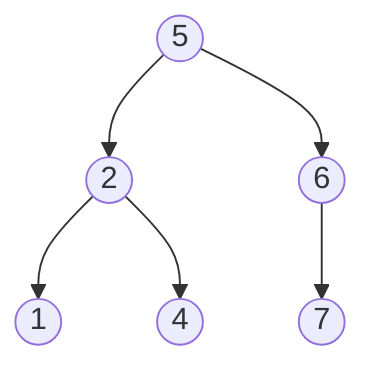
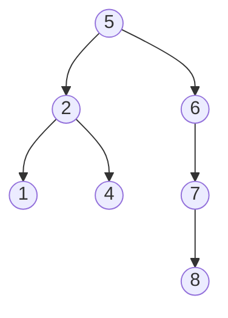

# Definition of BST 
A Binary Search Tree is a type of [[Binary Tree]] that implements a [[Sequence Data Structure]]. In a sequence, we want to maintain a specific order of our data. In the binary tree, when we perform an [[in-order traversal]], we want our traversal to reflect the sequence. 

It turns out that if the traversal order we are enforcing is that our sequence is strictly increasing, then our tree will maintain the sequence order of being sorted ([[Sorting]]). 

We also want to be able to implement a function like find$(k)$ where we determine if a key is in the tree in optimal time by performing [[Binary Search]]. 

We enforce this property by ensuring that all left [[subtree]]s of a given node have a value less than that of the [[root node]] of the subtree, and that the value of all nodes in the right subtree is greater, and that this property is recursive and true for all subtrees within our tree. 

We can implement a find function with these constraints that allows us to determine if $k$ is in the exact position we would expect it to be in:

Let us consider the following tree

Let us search for 9 from the root. 9 > 5, so go right, 9 > 6, go right, 7 > 9, go right. Since 7 has no children we can conclude 9 isn't in our tree.

Let's search for 1. 1 < 5, so go left, 1 < 2 so go left, and we get 1=1 at the last step. We can recursively describe our algorithm as the following:
```
def find(k):
	if root:
		if root.val == k:
			return root
		elif root.val < k:
			return find(root.right)
		else:
			return find(root.left)
	else:
		return None 
```
We can think of this algorithm as exactly being binary search but on a tree instead of just an array. It is like a generalization. BSTs have this name because they perform this operation. 

---
We need to note the definition for the size of a subtree beginning at the node, it consists of the number of nodes in the subtree. 

Say that if we knew the size of an arbitrary node $n$ in our tree, and the size of $n.left$ and $n.right$ assuming such trees exist. If we were to go through our traversal our node $n$ would be located at index of $i = n.left$ From here we can begin a [[Binary Search]] algorithm that runs in $O(h)$ where $h$ is the [[height]] of our binary tree. We can then develop an algorithm with the following:

* if $i$ = size($n$):
	* return $n$
* elif $i$ < size($n$):
	* return find(n.left,i)
* else i > size($n$):
	* return find(n.right,i-size($n.left$)-1)

We basically just partition our tree into two different halves and check the single root and keep going until we know it's on one side. We are able to keep applying this algorithm until we have isolated it to a single node, which runs in $O(h)$ time if it is given that the size operation is in constant time. 

When we deal with [[sets]] in binary search trees, we deal with keys, and the algorithm is essentially identical, this is just an interpretation for sequences. 

We can make use of this function to implement insert at a certain position as well. We have the size of each subtree of our binary tree already stored. If we update a node, we want to know how to maintain the size of all other nodes in our tree. 

We know that our tree has the property that:
$$\text{size}(n)=\text{size}(n.left)+\text{size}(n.right)+1$$
When we update the size of a node by adding or removing a node, we need to know what subtrees are affected by this operation. It turns out that we need to update all of the ancestors of our node. 

If we added a new node underneath 7, what nodes would need to be updated? Let us illustrate this quickly:

It would turn out that 5,6, and 7 would need to update, 1,2, and 4 are all unaffected. We therefore only need to update the [[ancestors]] of our node, which we can perform in $O(h)$ time. When we bump up our size of node 7, the others would also inductively bump up by 1. 

---
# Additional Subtree Properties 
We have just covered that if we update the smallest node in our subtree that the [[subtree size]] property is updated when we increment 1 node and all [[ancestors]]  nodes along the tree.  We can define our subtree properties as a property where by having knowledge of the current node, the left subtree of the node, and the right subtree, whereas global properties come from knowledge of the entire data structure. 
 

Some properties include, the min, max, product, sum, sum of squares, and many other properties. 