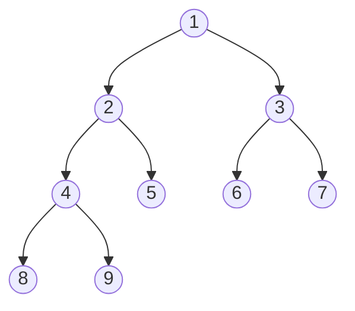
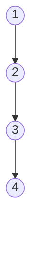
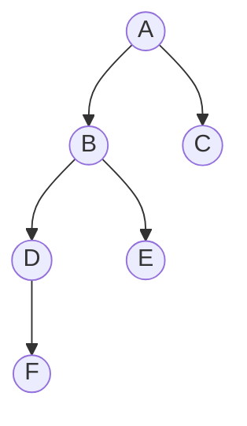
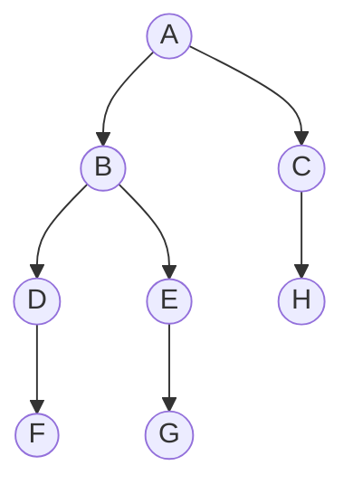
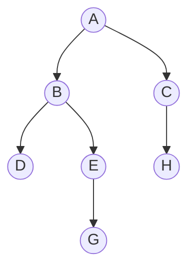
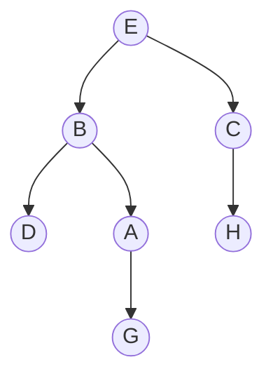
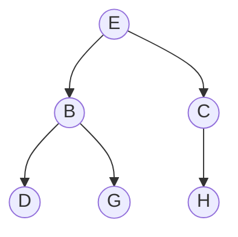

We want to construct a superior data structure that can do everything very fast. So far we have examined [[Sequence Data Structure]]s where we maintain things in a specified order and want to be able to insert things in that order without needing to traverse to the middle manually, so far what we've done is we've created [[Linked Lists]] which support efficient access to the tail and head pointers, but require a traversal to their center. With an array, inserting is VERY expensive as well. We are interested in performing things besides building in $n$. 

Binary trees help get us to a nice place where we can work with a sorted set of items and to modify it and add to the set in an efficient manner. 

# Definition of a Binary Tree 
A binary tree is a specific mathematical structure, it is a graph more specifically, where each node has between 0 to 2 children and there are no cycles. We can say that a binary tree is a $k$-ary tree with $k=2$. 



A binary tree has three different pointers and an item equipped with it. A node in the tree has a parent pointer, sometimes, a left node, and a right node. A key property of a binary tree is that for some node that has $n$ as a left or right child that:
```
n=n.left.parent
n=n.right.parent	
```

For instance, node 1 has a left pointer to 2, and a right pointer to 3. It stores the item 1. 
1 is the [[root node]], as it has no parents. All other nodes in the tree have parents. 

The [[leaf node]]s are 8,9,5,6, and 7 since they have no children.  

If we compare Binary trees to linked lists, traversing to the central node still has a linear time complexity, even if we add bidirectional pointers to make traversing easier The main idea and advantage of a binary tree is that a tree can have logarithmic height, and being able to traverse to any node within this time constraint. 

We define the [[subtree]] of a node, $x$ as $x$ and all of its descendants where we treated $x$ as a root node. 

The [[depth]] of a node, $x$ is the number of ancestors before a node, or we can also think of it as the number of [[edge]]s in the path from $x$ to the root. Every node is guaranteed to have one such unique node-to-root path. 

For instance, in the following, our node $1$ would have a depth of 0, $2$ would have a depth of $1$, 6 would have a depth of $2$, and $8$ would have a depth of $3$.

The [[height]] of a binary tree number of edges in a binary tree is the number of edges in the longest root to node path. In this tree it would be to either 8 or 9. The height is also equivalent to saying the maximum depth of a given node on a tree. 

If we consider the height of the sub trees formed by the leaf nodes, we would have a height of zero since these are already leaf nodes and have nowhere else to go. A layer above this, at nodes, 4,5,6 and 7 would have a height of 1. At 2,3 we would have a height of 2, and at node 1 we would have a height of 3. 

The height of our overall tree is $h$, the height of our root node. We want to prove that our runtime computations for searching algorithms on our trees are actually $O(h)$. We need to be able to constrain our $h$ to be $\text{log}(n)$. We can also run into cases where our binary tree degenerates into a linked list, and so our runtime would simply be $O(n)$ on all of our desired algorithms: 

---
# Traversal Types
We have different functions to traverse our binary trees. These are functions which begin at one node, move to the next node, and then to the left node, and then we place our processing node for the node we are at at either the beginning, middle, or end:

#### In-Order Traversal Order 
One such traversal, [[in-order traversal]] is a type of binary tree traversal that allows us to consider the left side of our tree during the traversal process and then the right tree. We basically are extracting every single subtree. 

In an in-order traversal, all nodes in  $x.$left of $x$ are in our traversal before $x$, and the nodes that show up after are from $x$.right. If we have a binary search tree, our values are presented in order. Our algorithm for this is pretty simple:
```
def in_order_traversal(root):
	if root:
		in_order_traversal(root.left)
		process(root)
		in_order_traversal(root.right)
```

If we have a [[Sequence Data Structure]] that we want to express as a binary tree, we would encode our items such that their in-order traversal would match the desired sequence. For [[Sorting]] we would show our keys increment as we iterate. 

Our in-order traversal would give us the left most node.  If we want to obtain our leftmost node our code would look like:

```
def first_subtree(root):
	if root.left:
		in_order_traversal(root.left)
	else:
		return root
```

If we want to find the [[successor]] of a node, that is the node which comes next in an order traversal, we need to consider all of the different subcases that we could run into. 

If our node has a right subtree, then we would return the successor of our right node. If our node has no such right node, we would return the first time we traverse a left branch, that means that when we climb up the tree that $\text{node.parent.left == node}$. 

If no such node is found, then it follows that there is no successor to this node and it is the last one. 

We would also like to know how to insert nodes after or before a given node. Say for the following tree we want to insert node $G$ before node $E$:

We have to insert it on the left side, because the node that will immediately be read in by our traversal will be the leftmost node. So this gives us our case when we have no left child present. Notice a right node would not affect this. 

If we want to insert $H$ after $A$, we want it to be on the left child of $C$. We go through all of the nodes on the left subtree left of $A$, and then we need to make $C$ the first node processed, making it the most left. 

In the general case for insertion of new node $A$ after a node $N$:
* If left subtree
	- Insert $A$ such that $A$ is the left child of the successor of $N.left$
* If no subtree
	* Insert $A$ on the left 

We can write this in python as:
```
def insert_before(A,N):
	if(N.left):
		succ = successor(N.left)
		succ.left = A 
	else:
		N.left = A
```
This works because we are guaranteed to not have any left children, so we can insert it there. This operation rune in $O(h)$ time. Insertion when no left branch is given is constant, and traversing is $O(h)$ time, and then inserting after is constant.

We can also consider deleting a node. Consider the following tree:


Let us consider the following deletions:

Let us delete $F$, and let us delete $A$.

If we delete $F$, then our resulting tree is:


All we do for removing leaf nodes is just remove the pointer from their parent to their node. We can either replace it by the predecessor or the successor depending upon if there is a left branch or not. The [[predecessor]] is the node in the left subtree which is the greatest in value. We want to swap this node with the root node, and then make sure its left and right children are appended back.

If it turns out that we have no left subtree, then we would use the right subtree and get its successor, or the smallest possible value from there. 

If we delete $A$, then we can summarize our results in the following;

First we need to put $A$ into node $E$, since $E$ is the greatest, and $G$ is left of $E$, so it is smaller:

Now we swap $G$ and $A$, and since $A$ is a leaf node, we can remove it:




In the general for deletion of node $N$:
* If $N$ is a leaf node just remove its parents connection to the node
	* Else if the subtree formed by $N$ has a left subtree, find its predecessor and put it there
* If subtree on left
	* Swap $N$ with predecessor($N$)
	* Delete $N$ when we get it to become a leaf node 
* Else (subtree on right)
	* Swap $N$ with successor($N$)
	* Delete $N$ when we get it to become a leaf node 

---
# Overview of Operation Runtime
In conclusion we found that the following operations correspond to a runtime of $O(h)$:
* Inserting a Node
* Deleting a Node
* Finding a Node
* Finding the Predecessor/Successor 

