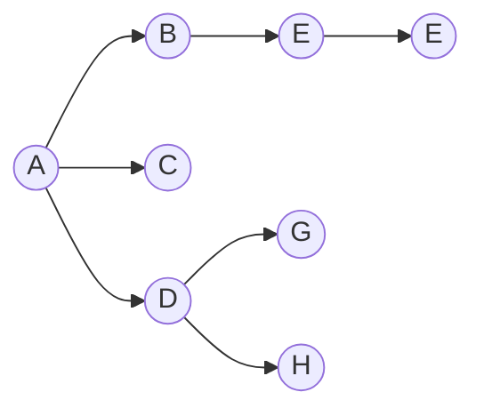

# Definition
The center of a [[Tree]] is the node or two nodes which are adjacent to each other that minimize the distance to every node in our [[Graph]]. 

In the following graph, we can recover the center node, $A$, by removing each leaf node continually until we end with one or two more nodes. We cannot have more than 2 nodes that are connected at the end as we would end up with a cycle, and would thus violate the definition of a tree. 

