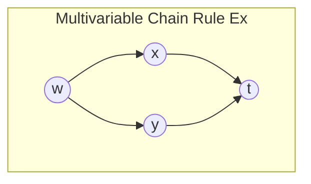
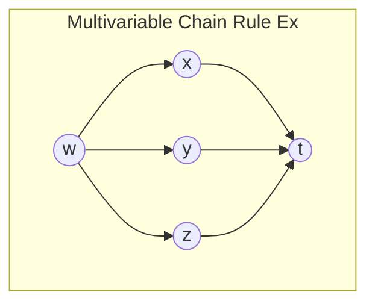

# Background 
We want to have more tools to study multivariable functions. We will discuss differentials. Differentials allow us to express how a function changes with respect to very small changes along the axes which it is defined. We will introduce differentials from our experience with them in single variable calculus, and eventually extend them to take on a more general multivariable notion. 

Looking at calculus 1, let us consider implicit differentiation. For some $y=f(x)$ we can express:
$$dy=f'(x)dx$$
For example, let us consider:
$$y=\text{sin}^{-1}(x)$$
$$\text{sin}(y)=(x)$$
Then taking the derivative on both sides yields:
$$  \frac{d}{dx}\text{sin}(y)=\frac{d}{dx}(x)$$
$$=\frac{dy}{dx} \text{cos}(y)=1$$
$$=\frac{dy}{dx} =\frac{1}{\text{cos(y)}}=\dfrac{1}{\text{cos}(\text{sin}^{-1}(x))}=\dfrac{1}{\sqrt{1-x^2}}$$
To extend this notation to the multivariable case, we need to be able to be able to formally define differentials and their associated rules. From this we will define the [[total differential]]. 

The total differential is composed of all the components that could change the function's value. For instance consider the function $f : \mathbb{R}^3 \rightarrow \mathbb{R}$ given by $f(x,y,z)$,

We can define its differential in the following:
$$df=\dfrac{\partial f}{\partial x}dx+ \dfrac{\partial f}{\partial y}dy+ \dfrac{\partial f}{\partial z}dz$$
$$df=f_{x}dx+f_{y}dy+f_{z}dz$$
We must ask, what are the objects we are working with here. They are not vectors, scalars, matrices, or anything that we have previously encountered. [[Differentials]] have their own proper rules for manipulation. 
### Differential Definition 
The most general definition of a differential is how changes in its values in $x,y$, and $z$, affect $f$. These are also "placeholders" for our variations, $\Delta x$,$\Delta y$, and $\Delta z$ which would give us our approximation formula for $\Delta f$:
$$\Delta f \approx f_{x}\Delta x + f_{y}\Delta y + f_{z}\Delta z    $$
We must note that the approximation is an approximation, when using deltas, and the original place holder is a formal equality.

A differential is not a number, a matrix, a vector, a scalar, or any previous object we have interacted with. Differentials are a new type of object with their own rules and manipulations. We can express them in terms of other differentials.

We can also divide our differentials by other differentials. Consider the parametric function, $f(x,y,z) : \mathbb{R}^3 \rightarrow \mathbb{R}$ where $f$ is a parametric function with parameters  $x=x(t),y=y(t),z=z(t)$.

To express the differential of this function would be tantamount to divide each side of the differential by $dt$:

$$\dfrac{df}{dt}=\dfrac{\partial f}{\partial x} \dfrac{dx}{dt}+ \dfrac{\partial f}{\partial y}\dfrac{dy}{dt}+ \dfrac{\partial f}{\partial z}\dfrac{dz}{dt}$$
This is an example of the "Multivariable Chain rule".

We may be inclined to ask, why is it that this process works? One way we can start is by considering our original differential and expressing it in terms of deltas to give ourselves an approximation, and then divide everything by $\Delta t$ :
$$\dfrac{\Delta f}{\Delta t} \approx f_{x}\dfrac{\Delta x}{\Delta t} + f_{y}\dfrac{\Delta y}{\Delta t} + f_{z}\dfrac{\Delta z}{\Delta t}    $$
We can then get a proper equality by allowing $\Delta t \rightarrow 0$ then each corresponding delta will become a derivative and give us our result from above.
##### Summary of Rules of Differentials 
1. We can express differentials in terms of other differentials 
2. We can divide by other differentials to get a rate of change 

We can think of them as placeholders which will take on the values of some $\Delta$. We can also think of them as "infinitesimals", as very very small nudges in a direction of the plane. 

It is very important to note that $df$ is $\textbf{NOT}$ $\Delta f$. $\Delta f$ is a scalar, and represents an actual number. $df$ is not a number, and the only thing we can do is express them in terms of other differentials. 

---
# Multivariable Chain Rule Examples
#### Multivariable Chain Rule is Equivalent to Single Variable Case
Let us consider $w : \mathbb{R}^3 \rightarrow \mathbb{R}$ where $w=x^2y+z$ and $x=t,y=e^t,z=\text{sin}(t)$. 

Via the multivariable chain rule our $\dfrac{dw}{dt}$ would yield:

$$\dfrac{dw}{dt}=2xy \dfrac{dx}{dt}+x^2\dfrac{dy}{dt}+\dfrac{dz}{dt}$$
$$=2xy +x^2e^t+\text{cos}(t)$$
$$=2te^t +t^2e^t+\text{cos}(t)$$
We can also think of $w$ as a function of $t$ instead, since each of its components are really just functions of $t$:
$$w=x^2y+z=t^2e^t+\text{sin}(t)$$
Then we can take the derivative with respect to $t$ to obtain:
$$\dfrac{dw}{dt}=2te^t +t^2e^t+\text{cos}(t)$$
#### Multivariable Chain Rule Yields Product Rule and Quotient Rules
Let us consider $w=uv$ where $u=u(t)$ and $v=v(t)$. Applying the multivariable chain rule will give us the product rule in the standard one dimensional case. Let us consider $\dfrac{dw}{dt}$:
$$\dfrac{dw}{dt}=w_{u}\cdot \dfrac{du}{dt}+w_{v}\cdot \dfrac{dv}{dt}=v\cdot \dfrac{du}{dt} + u \dfrac{dv}{dt} =  v\cdot u'(t)+u\cdot v'(t)$$
This clearly gives us the product rule. 

We can also get the quotient rule. Let $g=\dfrac{u}{v}$ where $u=u(t)$ and $v=v(t)$. Then we can compute $\dfrac{dg}{dt}$ to obtain:
$$\dfrac{dg}{dt}=f_{u} \cdot \dfrac{du}{dt}+f_{v} \cdot \dfrac{dv}{dt}= \dfrac{1}{v} \cdot u'(t) - \dfrac{u}{v^2} \cdot v'(t) = \dfrac{v\cdot u'(t)-u\cdot v'(t)}{v^2} $$
The resulting expression is clearly just the quotient rule. 

--- 
# Multivariable Chain Rule With More Variables 
Let us consider $w=f(x,y)$ where $x=x(u,v)$ and $y=(u,v)$. A practical example of this is if we are given a function in terms of polar coordinates, or if we have a function in cartesian that we want to convert to polar. 

Ideally, we want to be able to express the differential in terms of the  functions $\dfrac{\partial f}{ \partial u}$ and $\dfrac{\partial f}{ \partial v}$. This will be our end goal. If we were to express the differential as such it would take on the form:
$$dw=\dfrac{\partial f}{ \partial v}dv +\dfrac{\partial f}{ \partial u}du$$
We can recursively apply the definition of the differential to our variables until we reach the base case of a function which isn't dependent on any other variables. Thus we can express our differential of $w$ as the following:
$$dw=f_{x}\cdot dx+f_{y} \cdot dy=f_{x}(x_{u}\cdot du + x_{v} \cdot dv)+f_{y}(y_{u}\cdot du + y_{v} \cdot dv)$$
For clarification for future me, we just apply the definition of the differential to the $dx$ and $dy$ terms that's how we get this expression. 

We can further group our $du$ and $dv$ terms to obtain:
$$dw=(f_{x}x_{u}+f_{y}y_{u})du+(f_{x}x_{v}+f_{y}y_{v})dv$$
This tells us that $(f_{x}x_{u}+f_{y}y_{u})du=\dfrac{\partial f}{\partial u}du$ and $(f_{x}x_{v}+f_{y}y_{v})dv=\dfrac{\partial f}{\partial v}dv$.  

This entails that we have a way to express $\dfrac{\partial f}{ \partial v}$ and $\dfrac{\partial f}{ \partial u}$. We get the following:
$$\dfrac{\partial f}{\partial u}=\dfrac{\partial f}{\partial x} \cdot \dfrac{\partial x}{\partial u}+\dfrac{\partial f}{\partial y} \cdot \dfrac{\partial y}{\partial u}$$
$$\dfrac{\partial f}{\partial v}=\dfrac{\partial f}{\partial x} \cdot \dfrac{\partial x}{\partial v}+\dfrac{\partial f}{\partial y} \cdot \dfrac{\partial y}{\partial v}$$
We can remember these formulas by considering what $f$ depends on. $f$ depends on both $x$ and $y$, and when we are considering only what happens when we vary $u$, then we express the partial derivative of $x$ with respect to $u$ and $y$ with $u$ as well. 

We also cannot cancel these ratios since these are not numbers, and they do not fall into the definition of how differentials work. 

A useful example of this happening is in [[polar coordinates]]. Instead of using $(x,y)$ to describe a point, we use $r,\theta$ to describe a point. In order to do this we use the formulas:
$$x=r \cdot \text{cos}(\theta)$$
$$y=r \cdot \text{sin}(\theta)$$
We can express our differential in terms of the base variables $r$ and $\theta$:
$$df=f_{r}\cdot dr + f_{\theta} \cdot d\theta$$
$$f_{r}=\dfrac{\partial f}{ \partial r}= \dfrac{\partial f}{\partial x} \cdot \dfrac{\partial x}{\partial r} + \dfrac{\partial f}{\partial y} \cdot \dfrac{\partial y}{\partial r} = \dfrac{\partial f}{\partial x} \cdot \text{cos}(\theta) + \dfrac{\partial f}{\partial y} \cdot \text{sin}(\theta) $$
$$f_{\theta}=\dfrac{\partial f}{ \partial \theta}= \dfrac{\partial f}{\partial x} \cdot \dfrac{\partial x}{\partial \theta} + \dfrac{\partial f}{\partial y} \cdot \dfrac{\partial y}{\partial \theta} = -\dfrac{\partial f}{ \partial x}r\cdot \text{sin}(\theta) +\dfrac{\partial f}{ \partial y} \cdot r \cdot \text{cos}(\theta)$$
Thus it follows that: 
$$df= \left(\dfrac{\partial f}{\partial x} \cdot \text{cos}(\theta) + \dfrac{\partial f}{\partial y} \cdot \text{sin}(\theta) \right)dr+\left( -\dfrac{\partial f}{ \partial x}r\cdot \text{sin}(\theta) +\dfrac{\partial f}{ \partial y} \cdot r \cdot \text{cos}(\theta)  \right)d\theta$$
---
# Intro to the Gradient 
The [[Gradient]] vector of a function $f : \mathbb{R}^n \rightarrow \mathbb{R}$ a vector which consists of all of the partial derivatives of a function. 

We define the gradient as the vector which contains all partial derivatives of a function: 
$$\nabla f = \langle f_{x_{1}},f_{x_{2}},\cdots,f_{x_{n}} \rangle$$
---
# Alternative Way to Think About the Multivariable Chain Rule 
Another way that we can think of the chain rule is by using a diagram. If we consider some $w=f(x(t),y(t))$ determining our $dw$ would involve having to consider the partial derivatives of $f$ with respect to $x$ and $y$ since these are not our base functions, and then lastly having to consider the derivative of $x$ and $y$ with respect to $t$ since they both depend upon these values and there is no further line of dependence. 

We can think of this as taking partial derivatives and then multiply each path of the graph from one the root node at the top to the final node(s) at the bottom.

This would have us getting, for each path from $w$ to $z$:
$$dw=\dfrac{\partial w}{\partial x} \cdot \dfrac{dx}{dt} + \dfrac{\partial w}{\partial y} \cdot \dfrac{dy}{dt}$$
Here's another example for $w=(x(t),y(t),z(t))$, then we can construct the following diagram:

We obtain $dw$ as:
$$dw=\dfrac{\partial w}{\partial x} \cdot \dfrac{dx}{dt} + \dfrac{\partial w}{\partial y} \cdot \dfrac{dy}{dt}+ \dfrac{\partial w}{\partial z} \cdot \dfrac{dz}{dt}$$
