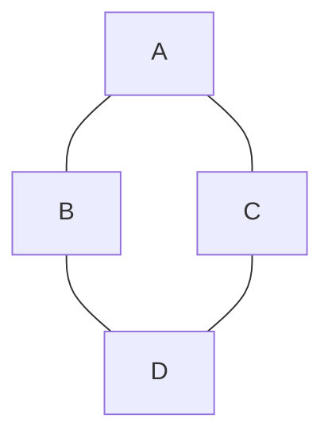

# Object Oriented Programming
[[Object Oriented Programming]] is a paradigm for developing programs which makes use of classes. A class can be instantiated into an object. Classes have methods and data. Methods manipulate the data. The data is conveniently grouped into the class container and helps us as a programmer by being able to easily access its contents. 

It is not directly a programming language, because we can implement classes on top of existing [[Functional Language]]s, [[Fundamentals of Programming Languages/Languages Overview/Programming Language]]s, and [[Imperative Language]]s. 

---
# Issues with OOP 

One large problem with OOP is the issue of bloating. In inheritance, the child classes of parent classes will inherit all of the methods of their parents. The solution to this is to be mindful about the classes we are constructing and the inheritance patterns that we are using. 

The second problem with OOP is the "Diamond Problem", which we can describe by the following relationship in inheritance.  

The compiler does not know which methods class D should inherit. Should D inherit some method from A,B, or C? It is not apparently clear. There have been theoretical approaches to handling the diamond problem, so it isn't a problem any longer in modern programming as much as it's handled by modern languages. Languages like C and C++ tend to use a full syntax that has the programmer specify what methods are chosen from what classes. 

Class structures can also be quite rigid. As software and its needs changes, class structures need to change to meet these needs. 

# Going Past OOP 
Some modern languages like GO and Rust have completely done away with inheritance. Only Swift actually maintains OOP. 