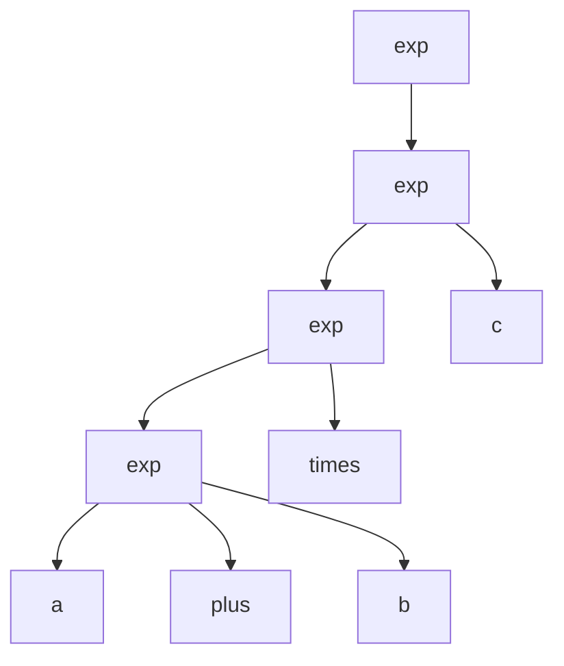

# [[Parse Tree]] Definition
A [[Parse Tree]] is a type of [[Tree]] which allows us to express any sentence in a language according to the grammar of a language. [[Parse Tree]]s grow downward. 

The fringes, that is the [[leaf node]]s of a [[Parse Tree]] forms a sentence in the language. 

# Example of a [[Parse Tree]]

For example let us consider a language which expects 3 steps of expressions, $+,*,$ and brackets $()$.

We should be able to convert a mathematical expression that uses just $+,*,()$ into a [[Parse Tree]]. For $a,b,c$ let us express $((a+b) \cdot c)$ as a syntax tree:

Determining a [[Parse Tree]] for some given string is known as "parsing the string". If a program can generate a [[Parse Tree]] for a given string in a language, then it can be said that that string is a part of the language. 

