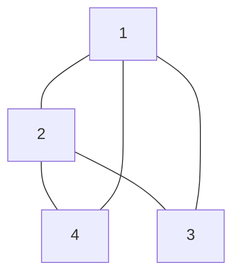

# Finding Clusters in Graphs 
If we are given a large [[Graph]], $G=\{V,E \}$, we may suspect that the [[Graph]] can be broken up into several [[clusters]].  We are interested in partitioning the vertices of $G$ into one set, $a$ and into another set $b$. We then want to find the [[centroid]]s $x$ and $y$ such that the following sum is minimized:
$$\sum_{a_{i} \in A} \|a_{i}-x\|^2+\sum_{b_{i} \in B} \|b_{i}-y\|^2$$
We impose the condition that $|a| \approx |b|$, Once $a$ and $b$ have been chosen, we want to determine the best $x$ and $y$ that satisfy our result. For a [[Graph]], it turns out that we can use [[K-means]] in order to solve this particular problem. This is because the best $x$ and $y$ that minimize the distance to their respective set is a [[centroid]], which we can compute via [[K-means]]. We set $k=2$, since for this problem we have 2 categories:

#### 1.) [[K-means]] Solution for [[Finding Clusters in Graphs]]

First what we do is:
1. Given some $a$ and $b$, find centroids $x,y$ for each set. 
2. Given $x,y$ we want to form the best clusters, assign each point to the nearest centroid
3. Recalculate centroids, if centroids are unchanged, then the algorithm has converged

There is no good measure of the rate of convergence for this particular algorithm. However, this is a valid and a quite popular way to answer this question. 

#### 2.) "Spectral Clustering"
When we talk about Spectral with reference to any kind of study, we are really referring to the [[eigen value]]s of a matrix. We begin with the [[Graph Laplacian Matrix]]:
$$L=A^TA$$
$A$ is the "[[Incidence Matrix]]" of the graph. $D$ is the degree matrix of the graph, and $B$ is the [[Adjacency Matrix]]. The [[Incidence Matrix]], $A \in \mathbb{R}^{m \times n}$.  It is also the case that $A$ is [[Symmetric Matrix]] and that $A$ is furthermore [[positive semidefinite]]. 

If we consider the following [[Undirected Graphs]]:

Here we can see that the corresponding [[Adjacency Matrix]] is:
$$B=\begin{bmatrix} 0 & 1 & 1 & 1\\
1 & 0 & 1 & 1\\
1 & 1 & 0 & 0\\
1 & 1 & 0 & 0\\
\end{bmatrix}$$
We can also see that the [[Degree Matrix]] is:
$$D=\begin{bmatrix} 3 & 0 & 0 & 0\\
0 & 3 & 0 & 0\\
0 & 0 & 2 & 0\\
0 & 0 & 0 & 2\\
\end{bmatrix}$$
So we can determine $L$ quite easily:
$$L=D-B=\begin{bmatrix} 3 & -1 & -1 & -1\\
-1 & 3 & -1 & -1\\
-1 & -1 & 2 & 0\\
-1 & -1 & 0 & 2\\
\end{bmatrix}$$
Notice also that $\text{dim}(N(L))=1$, since we have 1 eigen vector in the [[Nullspace]] of $L$. We have that the [[eigen vectors]] associated with the eigen value of $0$ is $x=[1,1,1,1]^T$. We are interested here in the eigen vector associated with $\lambda_{\text{min}} > 0$. This is known as the [[Fiedler Eigen Vector]]. 

The [[Fiedler Eigen Vector]]  helps us solve our clustering problem. The [[Fiedler Eigen Vector]] has positive and negative components. The positive components correspond to one group, and the negative elements correspond to another group. Computation of the [[eigen vectors]] can be expensive, so there are many approaches to numerically solve the problem. 

If we wanted to find the lowest $k$ clusters, we would examine the lowest $n$ [[eigen vectors]] as a way to extend this problem from $2$ to $k$ many clusters. 
 
