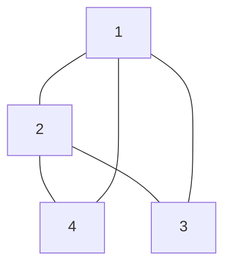

# Adjacency Matrix
The [[Adjacency Matrix]] is formed by considering some [[Graph]], $G$. Let $G$ have $n$ vertices. The adjacency matrix, $B \in \mathbb{R}^{n \times n}$. We have that [[Trace]], $\text{Tr}(B)=0$, since we consider [[Simple Graphs]] where $G$ is not allowed to have edges with itself. Furthermore, we can look at our Matrix row wise. For row $i$, we look at vertex $i$. If $i$ shares a connection with any of the other $n-1$ vertices, we put the corresponding weight between the two in our [[Adjacency Matrix]]. 

(I'm not that good with mermaid, imagine this is an [[Undirected Graphs]])

Given that this is undirected we can construct the following [[Adjacency Matrix]] for this example graph:
$$B=\begin{bmatrix} 0 & 1 & 1 & 1\\
1 & 0 & 1 & 1\\
1 & 1 & 0 & 0\\
1 & 1 & 0 & 0\\
\end{bmatrix}$$

