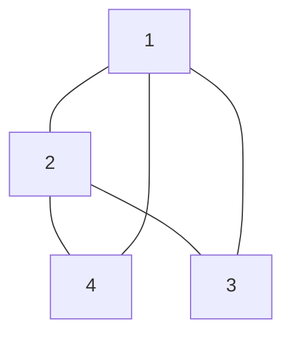

# Graph Laplacian Matrix 
The [[Graph Laplacian Matrix]] is a symmetric matrix constructed from either the [[Incidence Matrix]], $A \in \mathbb{R}^{m \times n}$ where $m$ is the number of edges and $n$ is the number of vertices, or from the [[Degree Matrix]] $D$ and the [[Adjacency Matrix]] for [[Graph]] $G$, which is $B$. We thus have:
$$L=A^TA=D-B$$
If we consider the following [[Undirected Graphs]]:

Here we can see that the corresponding [[Adjacency Matrix]] is:
$$B=\begin{bmatrix} 0 & 1 & 1 & 1\\
1 & 0 & 1 & 1\\
1 & 1 & 0 & 0\\
1 & 1 & 0 & 0\\
\end{bmatrix}$$
We can also see that the [[Degree Matrix]] is:
$$D=\begin{bmatrix} 3 & 0 & 0 & 0\\
0 & 3 & 0 & 0\\
0 & 0 & 2 & 0\\
0 & 0 & 0 & 2\\
\end{bmatrix}$$
So we can determine $L$ quite easily:
$$L=D-B=\begin{bmatrix} 3 & -1 & -1 & -1\\
-1 & 3 & -1 & -1\\
-1 & -1 & 2 & 0\\
-1 & -1 & 0 & 2\\
\end{bmatrix}$$
Notice also that $\text{dim}(N(L))=1$, since we have 1 eigen vector in the [[Nullspace]] of $L$. 

The reason why we call the [[Graph Laplacian Matrix]] a "Laplacian"? I'm a bit unsure of this, but it seems like our main point of investigating this thing is to find the [[Fiedler Eigen Vector]], so we have to concern ourselves with the [[eigen values]] of the [[Graph Laplacian Matrix]], such that we find the smallest $\neq 0$, so we need to find the nullspace, which seems similar to the [[Laplacian]] 