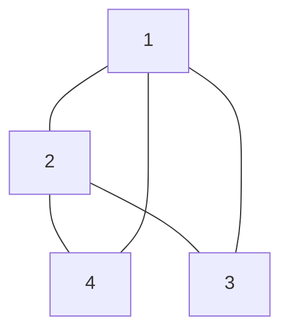

# Incidence Matrix
Let us consider the following [[Graph]]:
(I'm not that good with mermaid, imagine this is an [[Undirected Graphs]])

Given that this is undirected we can construct the following [[Incidence Matrix]] for this example graph. We have $4$ vertices, which has 5 edges. The [[Incidence Matrix]], $A \in \mathbb{R}^{m \times n}$  where $m$ is the number of edges and $n$ is the number of vertices. For each edge in our graph, we consider each outgoing edge. The node it goes from is given a $-1$, and the node it goes to is given a 1. We can thus construct the following [[Incidence Matrix]]. We label the [[Graph]] as well, so here is the original [[Graph]] from the Strang lecture:

![[Pasted image 20260107083527.png]]

I assume the index of the edge is how set it to each row:
$$A=\begin{bmatrix}
	-1 & 1 & 0 & 0\\
	-1 & 0 & 1 & 0\\
	-1 & 0 & 0 & 1\\
	0 & -1 & 0 & 1\\
	0 & -1 & 1 & 0
\end{bmatrix}$$
